# Event Map

Fullstack application for discovering and joining events in Berlin.


## Preview

### Start Page

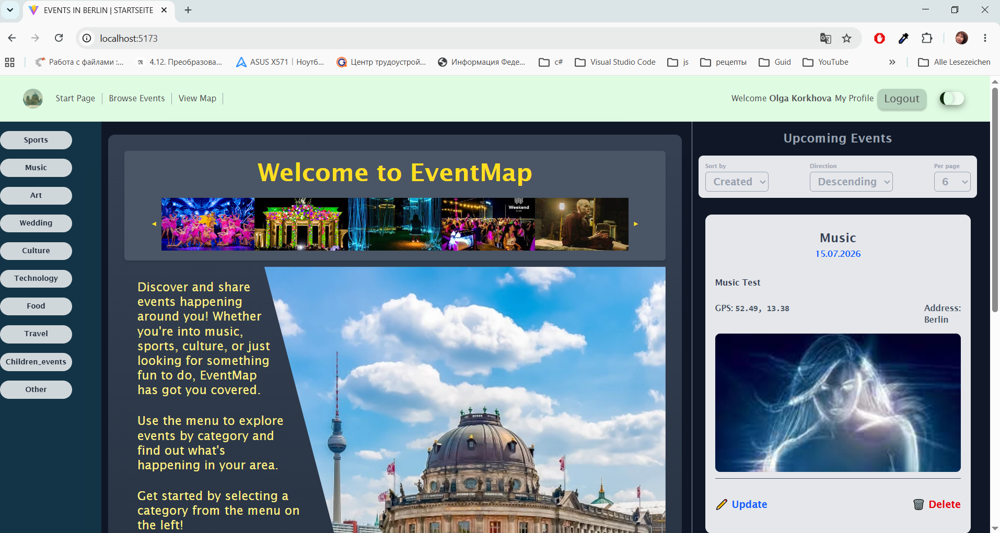

### Start Page (black mode)


### Login

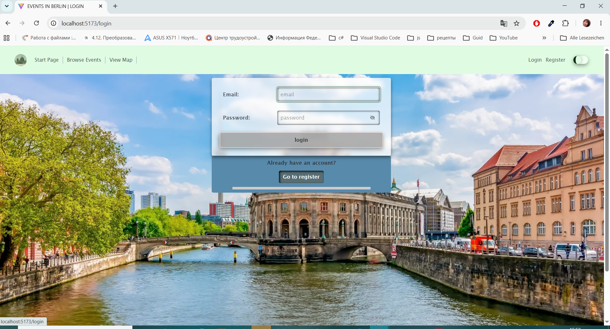

### Login (black mode)

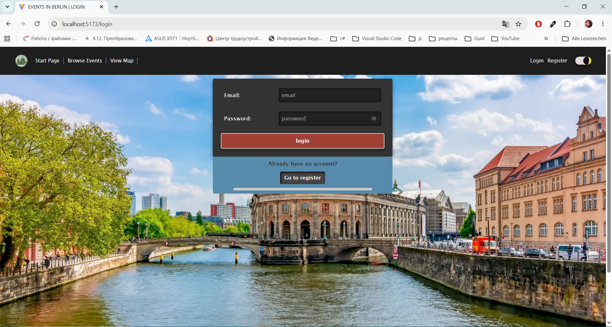

### Register

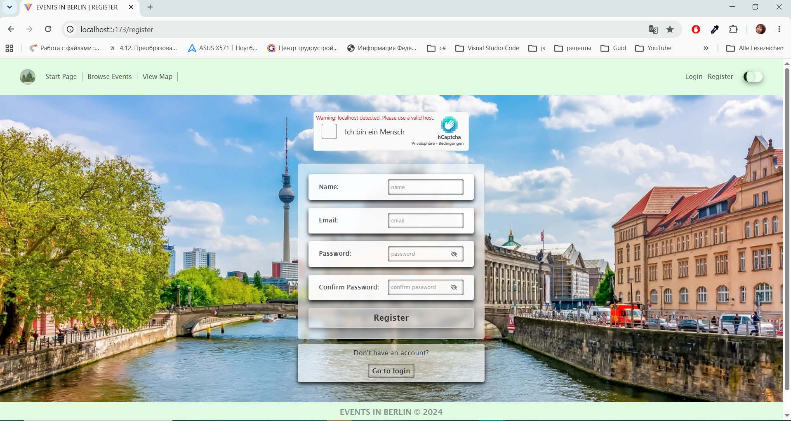

### Register (black mode)

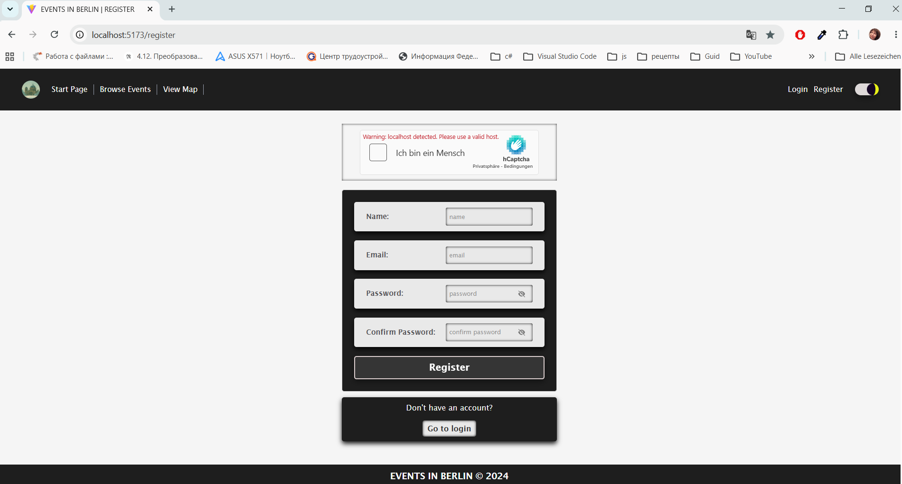

### My Profile

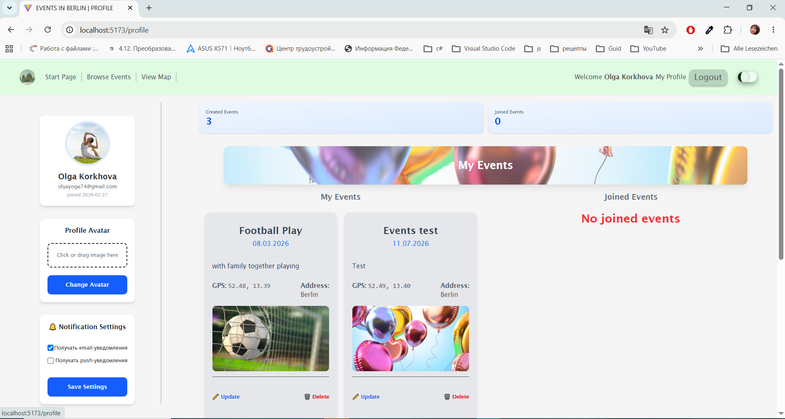

### Browse Event 

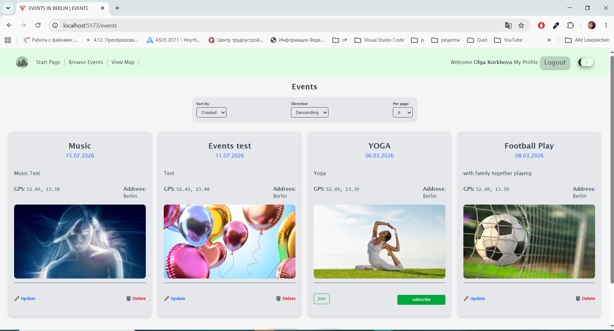

### Create Event

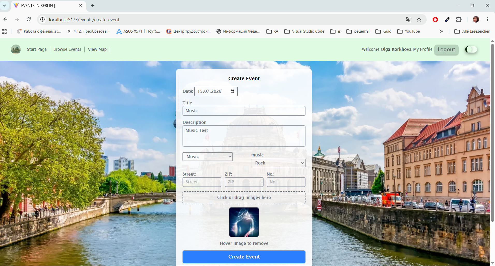

### View Map
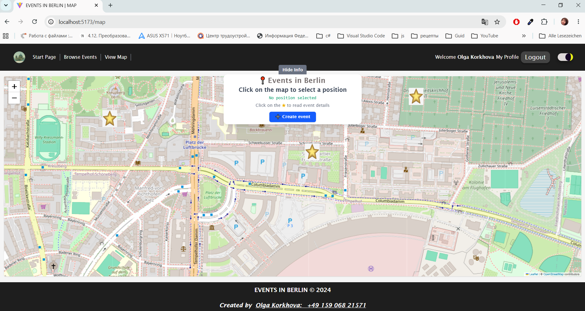

### Responsive Event

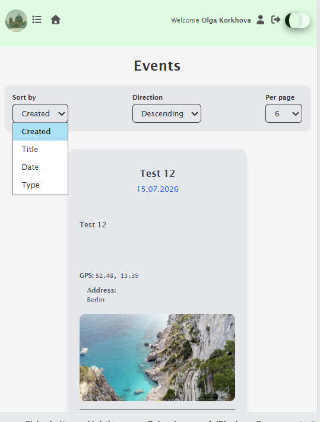

### Responsive Profile

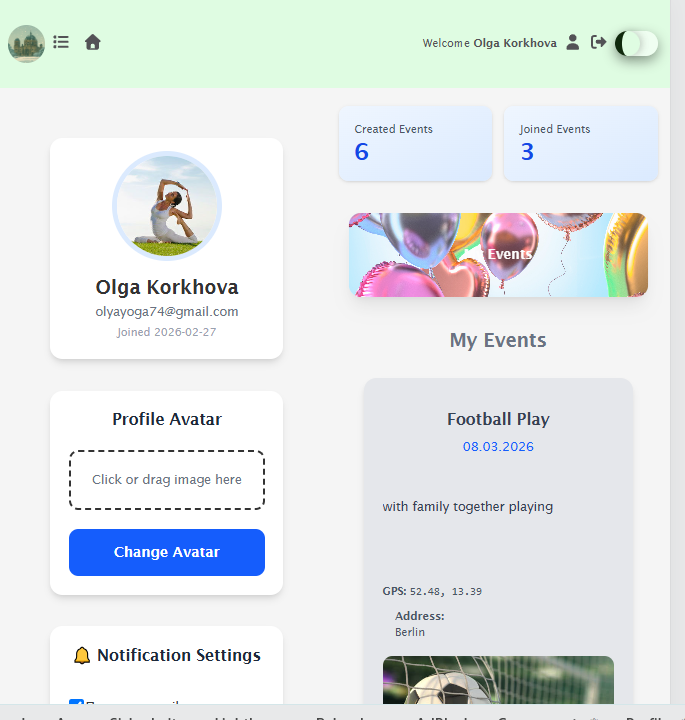

### Responsive Profile2

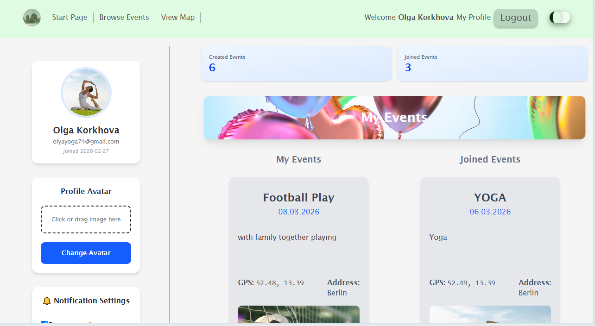

### Responsive Start Page

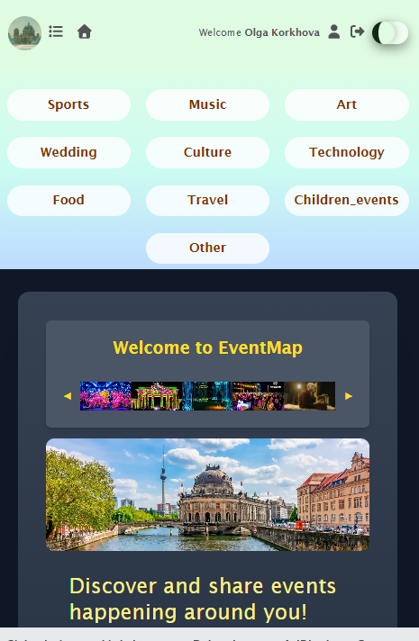

## Tech Stack
- Frontend: React, TypeScript, Vite, TailwindCSS
- Backend: Node.js, Express
- State management: Redux Toolkit, RTK Query
- Database: MongoDB
- Monorepo structure

## Project Structure

```text
EVENT-MAP/
├─ frontend/        # React application
├─ backend/         # API server
├─ packages/
│  └─ shared/       # Shared TypeScript types
```

## Features

- Authentication

- Browse events

- Join / cancel participation

- Create and manage events

- Interactive map

- Dark / light theme

- Responsive UI

### Getting Started
```
npm install
npm run dev
```
### in event-map\backend\src\services\mail-service.ts  
######  ```to:process.env.EMAIL_USER replace with to```
```
 to:to 
```